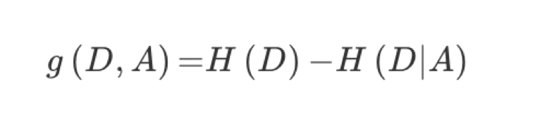
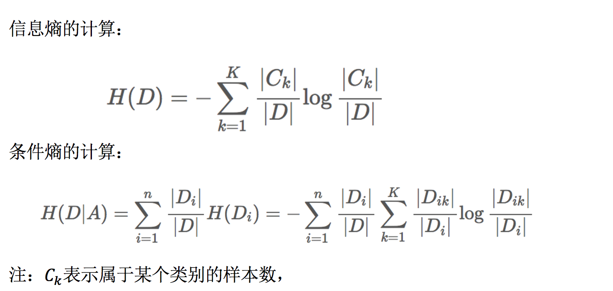

[toc]

## 决策树

## 1. 决策树算法简介
> 决策树：是一种树形结构，其中每个内部节点表示一个属性上的判断，每个分支代表一个判断结构的输出，最后每个叶节点代表一种分类结果，本质是一棵由多个判断节点组成的树。

决策树学习的目的是为了产生一棵泛化能力强，即处理未见示例能力强的决策树，其基本流程遵循简单且直观的“分而治之”策略。

决策树的生成是一个递归过程，有三种情况会导致递归返回：
  （1）当前节点包含的样本全属于同一类别，无需划分；
  （2）当前属性集为空，或是所有样本在所有属性上取值相同，无法划分；将当前节点设定为**该节点所含样本最多的类别**。
  （3）当前节点包含的样本集合为空，不能划分；将当前节点标记为叶节点，但将其类别设定为**其父节点所含样本最多的类别**。

## 2.分类原理
> 决策树学习的关键在于如何选择最优划分属性。一般而言，随着划分过程不断进行，我们希望决策树的分支结点所包含的样本尽可能属于同一类别，即结点的“”纯度“”越来越高。

### 2.1 熵
物理学上，熵（Entropy）是“混乱”程度的度量。

系统越有序，熵值越低；系统越混乱或者分散，熵值越高。
- 从信息的完整性上描述：
  当系统的有序状态一致时，数据越集中的地方熵值越小，数据越分散的地方熵值越大。
- 从信息的有序性上描述：
  当数据量一致时，系统越有序，熵值越低；系统越混乱或者分散，熵值越高。

### 2.2 信息熵
信息熵（information entropy）是度量样本集合纯度最常见的一种指标。

假定当前样本集合 D 中第 k 类样本所占的比例为 $p_k( k = 1,2,...,|y|)$，则 D 的信息熵定义为


$ Ent(D) $  的值越小，则 $ D $ 的纯度越高。

### 2.2 信息增益
> 信息增益：以某特征划分数据集前后的熵的差值。熵可以表示样本集合的不确定性，熵越大，样本的不确定性就越大。因此可以使用划分前后集合熵的差值来衡量使用当前特征对于样本集合 D 划分效果的好坏。

- 公式
  - 属性A对训练数据集 D 的信息增益 $g(D,A)$，定义为集合 D 的信息熵 H(D)与属性 A 给定条件下 D 的信息条件熵 H(D|A) 之差，即：
  
    
    
   - 公式详解
   
     
     
     > 注：信息增益表示得知特征 X 的信息而使得类 Y 的信息熵减少的程度
     
     > **一般来说，信息增益越大，意味着使用属性 A 来进行划分所获得的“纯度”提升越大 **
- 案例

   
   
   当前属性集合{ 色泽，根蒂，敲声，纹理，脐部，触感  }，以属性“色泽”为例，记
   >  $D^1(色泽=青绿)$
   
   >  $D^2(色泽=乌黑)$
   
   >  $D^3(色泽=浅白)$
   
   >  $ D^1 $包含编号 {1,4,6,10,13,17}
   
   >  $ D^2 $包含编号 {2,3,7,8,9,15}
   
   >  $ D^3 $包含编号 {5,11,12,14,16}
   
   1. **信息熵计算**
   
   
   
   2. **信息增益计算**
   
   
   
   3. **类似的，计算出其他属性的信息增益：**
   
      $Gain(D,根蒂)=0.143$
    
      $Gain(D,敲声)=0.141$
    
      $Gain(D,脐部)=0.289$
    
      $Gain(D,触感)=0.006$
    
      $Gain(D,纹理)=0.381$
    
   4. **显然，属性“纹理”的信息增益最大，于是它被选为划分属性。于是基于“纹理”对根结点进行划分。**
   
   
   
   5. **然后，对每个分支结点做进一步划分。如基于 $D^1$ 计算出各属性的信息增:**
   
       $Gain(D^1,色泽)=0.043$  
       
       $Gain(D^1,根蒂)=0.458$
       
       $Gain(D^1,敲声)=0.331$
       
       $Gain(D^1,脐部)=0.458$
       
       $Gain(D^1,触感)=0.458$
       
   6. **类似，对每个分支结点执行上述操作，最终得到决策树。**
   
   
   

### 2.3 信息增益率
> 实际上，信息增益准则对可取值数目较多的属性有所偏好，为减少这种偏好可能带来的不利影响，可以不直接使用信息增益，而是使用增益率来选择最优划分属性。

- 增益率定义

  
  
  IV(a) 称为属性 a 的“固有值”(intrinsic value)。属性 a 的可能取值数目越多（即 V 越大），则 IV(a) 的值通常会越大。
  
> 增益率准则对可取值数目较少的属性有所偏好，C4.5 算法使用了一个启发式：先从候选划分属性中找出信息增益高于平均水平的属性，再从中选择增益率最高的。

### 2.4 基尼指数
- 数据集 D 的纯度可用基尼值来度量：

    
    
> Gini(D) 反映从数据集 D 中随机抽取两个样本，其类别标记不一致的概率。因此 Gini(D) 越小，则数据集 D 的纯度越高。

- 属性 a 的基尼指数定义为:

    
    
    于是可在候选属性集合 A 中，选择那个使得划分后基尼指数最小的属性作为最优划分属性。

### 2.4 常见决策树

- 使用的分类原理

  

## 3. 剪枝处理
### 3.1 为什么要剪枝

  

> 横轴：决策树创建过程中结点总数    纵轴：预测精度
> 实线：训练集上精度    虚线：测试集上精度
> 随着树的增长，决策树在训练集上的精度单调上升，但在独立的测试集熵先上升后下降
> - 出现这样情况的原因：
>   - 噪声、样本冲突，即错误的样本数据
>   - 特征不能完全作为分类标准
>   - 巧合的规律性，数据量不够大

剪枝是决策树学习算法对付“过拟合”的主要手段。决策树学习过程中，可能会造成树分支过多，使树因训练样本学得“太好了”，以致于将训练集自身的一些特点当作一般性质。因此，可以通过主动去掉一些分支来降低过拟合的风险。

### 3.2 预剪枝(prepruning)
> 预剪枝是指在决策树生成过程中，对每个节点在划分前先进行估计，若当前节点的划分不能带来决策树泛化性能提升，则停止划分并将当前结点标记为叶结点。
- 西瓜数据集2.0划分出（留出法）的训练集与验证集

  

- 采用信息增益准则生成的决策树

  

- 基于信息增益生成的预剪枝决策树

  
  
   1. 先将所有样例集中在根结点，并不划分将该结点标记为叶结点。
   
   2. 用验证集验证精度为 42.9%
   
   3. 用属性“脐部”划分之后，用验证集验证划分精度为 71.4% > 42.9%
   
   4. 确认进行划分。
   
   5. 对接下来个子结点重复上述步骤。
   
   > 1. 预剪枝会使得决策树很多分支没有展开，这不仅会降低过拟合风险，还显著减少了训练时间开销和测试时间开销；
   > 2. 另一方面，有些分支虽然当前划分不能提升泛化性能，甚至可能导致泛化性能下降，但在其基础上进行的后续划分却可能致使性能提高；
   > 3. 预剪枝基于贪心本质禁止这些分支展开，给**预剪枝决策树带来了欠拟合的风险**。
   
- 其他预剪枝方法
  1. 指定每一个结点所包含的最小样本数。例如10，则该结点总样本数小于10时，不再划分；
  2. 执行树的高度或者深度。
  3. 指定结点的熵小于某值后不再划分。

### 3.3 后剪枝(postpruning)
> 后剪枝是先从训练集生成一棵完整的决策树，然后自底向上地对非叶结点进行考察，若将该结点对应的子树替换为叶结点能带来泛化性能提升，则将该子树替换为叶结点。
- 基于信息增益准则生成的决策树（精度42.9%）

  
  
  1. 先考察结点⑥。若将其分支剪出，相当于把⑥替换为叶子结点，类别标记为样本中最多的类“好瓜”。此时决策树验证集精度提高至 57.1%。于是后剪枝策略决定剪枝。
  2. 然后从下往上依次考察⑤~①结点。
  
  > - 后剪枝决策树通常比预剪枝决策树**保留了更多的分支**。
  > - 一般情况下，后剪枝决策树的欠拟合风险很小，**泛化性能往往优于预剪枝决策树**。
  > - 后剪枝过程是在生成完全决策树之后，因此**训练时间开销比未剪枝、预剪枝决策树大得多**。

## 4. 案例：泰坦尼克号乘客生存预测
- 数据集
  > PassengerID：乘客编号
  > Survived：是否幸存
  > Pclass：船票等级
  > Name：姓名
  > Sex：性别
  > Age:年龄（存在缺失）
  > SibSp：亲戚数量，兄妹、配偶等
  > Parch：父母、子女等
  > Ticket：船票号码
  > Fare：船票价格
  > Cabin：船舱
  > Embarked：登陆港口

- 步骤分析

  1. 获取数据
  
  2. 数据基本处理
  
       2.1 确定特征值，目标值
       
       2.2 缺失值处理
       
       2.3 数据集划分
       
  3. 特征工程（字典特征抽取）
  
  4. 机器学习（决策树）
  
  5. 模型评估
  
- 完整代码
```python
import pandas as pd
import numpy as np
from sklearn.feature_extraction import DictVectorizer
from sklearn.model_selection import train_test_split
from sklearn.tree import DecisionTreeClassifier, export_graphviz


# 1. 获取数据
data = pd.read_csv("./data/Titanic_Data/train.csv")

# 2. 数据基本处理
# 2.1 确定目标值，特征值
x = data[["Pclass","Sex","Age"]]
y = data["Survived"]

# 2.2 缺失值处理
x['Age'].fillna(x['Age'].mean(),inplace=True)

# 2.3 数据集划分
x_train, x_test, y_train, y_test = train_test_split( x, y, test_size=0.2, random_state=13)

# 3. 特征工程
# 特征中出现类别符号，可以 one-hot 编码处理（DictVectorizer）
# [{"Pclass": "1st", "Age": 29.00, "Sex": "female"}, {}]
# one-hot 编码：
# ['age','Pclass=1st','Pclass=2nd','Pclass=3rd','Sex=femal','Sex=male']

transfer = DictVectorizer(sparse=False)
x_train = transfer.fit_transform(x_train.to_dict(orient="records"))
x_test = transfer.fit_transform(x_test.to_dict(orient="records"))

# 4. 模型训练
# 设置树的最大深度，限制树的大小
estimator = DecisionTreeClassifier(criterion='entropy', max_depth=5)
# estimator = DecisionTreeClassifier(criterion='entropy')
estimator.fit(x_train, y_train)

# 5. 模型评估
estimator.score(x_test, y_test)

estimator.predict(x_test)
```

## 5.决策树可视化
- 保存树的结构到 dot 文件
  - `sklearn.tree.export_graphviz() 该函数能够导出DOT格式`
     - `tree.export_graphviz(estimator,out_file='tree.dot’,feature_names=[‘’,’’])`

  ```python
  # export_graphviz(estimator, out_file="./data/Titanic_Data/tree.dot",   feature_names=['Age', 'Pclass=1st', 'Pclass=2nd', 'Pclass=3rd', '女性', '男性'])
  export_graphviz(estimator, out_file="./data/Titanic_Data/tree.dot", feature_names=['Age', 'Pclass', 'Sex', 'Survived'])
  ```
- 网站显示树的结构
> http://webgraphviz.com/
> 将 dot 文件内容复制到该网站当中显示
