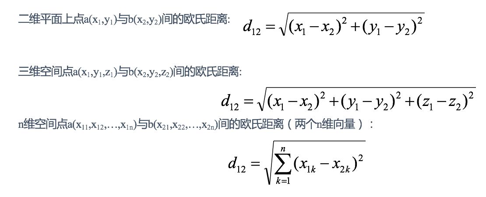
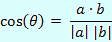

[toc]

# K近邻学习
## 1. 算法简介
> k近邻（k-Nearest Neighbor，简称 kNN）学习是一种常用的监督学习方法，其工作机制非常简单：给定测试样本，基于某种距离度量找出训练集中与其最靠近的 k 个训练样本，然后基于这 k 个“邻居”的信息来进行预测。

- 举例描述
  假设现在有几部电影


  其中 ? 电影不知道类别，如何去预测？利用 k 近邻算法的思想


  分别计算每个电影与被预测电影之间的距离，然后取 k（=5） 个最靠近样本中大多数样本所属于的类别。


## 2. 距离度量
### 2.1 欧氏距离（Euclidean Distance）
> 欧式距离是最容易直观理解的距离度量方法



### 2.2 曼哈顿距离(Manhattan Distance)
> 在曼哈顿街区要从一个十字路口开车到另一个十字路口，驾驶距离显然不是两点间的直线距离。这个实际驾驶距离就是“曼哈顿距离”。曼哈顿距离也称为“城市街区距离”(City Block distance)。


### 2.3 切比雪夫距离 (Chebyshev Distance)
> 国际象棋中，国王可以直行、横行、斜行，所以国王走一步可以移动到相邻8个方格中的任意一个。国王从格子(x1,y1)走到格子(x2,y2)最少需要多少步？这个距离就叫切比雪夫距离。


### 2.4 闵可夫斯基距离(Minkowski Distance)
> 闵氏距离不是一种距离，而是一组距离的定义，是对多个距离度量公式的概括性的表述。

两个n维变量a(x11,x12,…,x1n)与b(x21,x22,…,x2n)间的闵可夫斯基距离定义为：


- 其中p是一个变参数：

  - 当p=1时，就是曼哈顿距离；

  - 当p=2时，就是欧氏距离；

  - 当p→∞时，就是切比雪夫距离。

  根据p的不同，闵氏距离可以表示某一类/种的距离。
  
### 2.5 小结
1. 闵氏距离，包括曼哈顿距离、欧氏距离和切比雪夫距离都存在明显的缺点:

    e.g. 二维样本(身高[单位:cm],体重[单位:kg]),现有三个样本：a(180,50)，b(190,50)，c(180,60)。

    a与b的闵氏距离（无论是曼哈顿距离、欧氏距离或切比雪夫距离）等于a与c的闵氏距离。但实际上身高的10cm并不能和体重的10kg划等号。

2. 闵氏距离的缺点：

    (1) 将各个分量的量纲(scale)，也就是“单位”相同的看待了;

    (2) 未考虑各个分量的分布（期望，方差等）可能是不同的。
    
### 2.6 标准化欧氏距离 (Standardized Euclidean Distance)

标准化欧氏距离是针对欧氏距离的缺点而作的一种改进。

> 思路：既然数据各维分量的分布不一样，那先将各个分量都“标准化”到均值、方差相等。假设样本集X的均值(mean)为m，标准差(standard deviation)为s，X的“标准化变量”表示为：


   如果将方差的倒数看成一个权重，也可称之为加权欧氏距离(Weighted Euclidean distance)。

### 2.6 余弦距离(Cosine Distance)

> 几何中，夹角余弦可用来衡量两个向量方向的差异；机器学习中，借用这一概念来衡量样本向量之间的差异。

- 二维空间中向量A(x1,y1)与向量B(x2,y2)的夹角余弦公式：


- 两个n维样本点a(x11,x12,…,x1n)和b(x21,x22,…,x2n)的夹角余弦为：


   即：


夹角余弦取值范围为[-1,1]。余弦越大表示两个向量的夹角越小，余弦越小表示两向量的夹角越大。

当两个向量的方向重合时余弦取最大值1，当两个向量的方向完全相反余弦取最小值-1。

### 2.7 汉明距离(Hamming Distance)

> 两个等长字符串s1与s2的汉明距离为：将其中一个变为另外一个所需要作的最小字符替换次数。

> 例如：
>   The Hamming distance between "1011101" and "1001001" is 2. 
>   The Hamming distance between "2143896" and "2233796" is 3. 
>   The Hamming distance between "toned" and "roses" is 3.

**汉明重量**：是字符串相对于同样长度的零字符串的汉明距离，也就是说，它是字符串中非零的元素个数：对于二进制字符串来说，就是 1 的个数。

### 2.8 杰卡德距离(Jaccard Distance)

杰卡德相似系数(Jaccard similarity coefficient)：两个集合A和B的交集元素在A，B的并集中所占的比例，称为两个集合的杰卡德相似系数，用符号J(A,B)表示：


杰卡德距离(Jaccard Distance)：与杰卡德相似系数相反，用两个集合中不同元素占所有元素的比例来衡量两个集合的区分度：


### 2.9 马氏距离(Mahalanobis Distance)
直观解释：
下图有两个正态分布图，它们的均值分别为a和b，但方差不一样，则图中的A点离哪个总体更近？或者说A有更大的概率属于谁？显然，A离左边的更近，A属于左边总体的概率更大，尽管A与a的欧式距离远一些。这就是马氏距离的直观解释。


马氏距离是基于样本分布的一种距离，表示数据的协方差距离，它是一种有效计算两个位置样本集的相似度的方法。

与欧式距离不同的是，它考虑到各种特性之间的联系，即独立于测量尺度。

- **马氏距离定义**
设总体G为m维总体（考察m个指标），均值向量为μ=（μ1，μ2，… ...，μm，）`,协方差阵为∑=（σij）,则样本X=（X1，X2，… …，Xm，）`与总体G的马氏距离定义为：

   

  马氏距离也可以定义为两个服从同一分布并且其协方差矩阵为∑的随机变量的差异程度：如果协方差矩阵为单位矩阵，马氏距离就简化为欧式距离；如果协方差矩阵为对角矩阵，则其也可称为正规化的欧式距离。

- 马氏距离特性：

  1. **量纲无关**，排除变量之间的相关性的干扰；
  2. **马氏距离的计算是建立在总体样本的基础上的**，如果拿同样的两个样本，放入两个不同的总体中，最后计算得出的两个样本间的马氏距离通常是不相同的，除非这两个总体的协方差矩阵碰巧相同；
  3. 计算马氏距离过程中，**要求总体样本数大于样本的维数**，否则得到的总体样本协方差矩阵逆矩阵不存在，这种情况下，用欧式距离计算即可。
  4. 还有一种情况，满足了条件总体样本数大于样本的维数，但是协方差矩阵的逆矩阵仍然不存在，比如三个样本点（3，4），（5，6），（7，8），这种情况是因为这三个样本在其所处的二维空间平面内共线。这种情况下，也采用欧式距离计算。

## 3. k 值的选择
- K值过小：  
   - 容易受到异常点的影响
- k值过大：
   - 受到样本均衡的问题
- k值的选择分析
  1. 选择较小的K值，就相当于用较小的领域中的训练实例进行预测，“学习”近似误差会减小，只有与输入实例较近或相似的训练实例才会对预测结果起作用，与此同时带来的问题是“学习”的估计误差会增大，换句话说，K值的减小就意味着整体模型变得复杂，容易发生过拟合；
  2. 选择较大的K值，就相当于用较大领域中的训练实例进行预测，其优点是可以减少学习的估计误差，但缺点是学习的近似误差会增大。这时候，与输入实例较远（不相似的）训练实例也会对预测器作用，使预测发生错误，且K值的增大就意味着整体的模型变得简单。
  3. K=N（N为训练样本个数），则完全不足取，因为此时无论输入实例是什么，都只是简单的预测它属于在训练实例中最多的类，模型过于简单，忽略了训练实例中大量有用信息。
  4. 在实际应用中，K值一般取一个比较小的数值，例如采用交叉验证法（简单来说，就是把训练数据在分成两组:训练集和验证集）来选择最优的K值。对这个简单的分类器进行泛化，用核方法把这个线性模型扩展到非线性的情况，具体方法是把低维数据集映射到高维特征空间。
- 近似误差：对现有训练集的训练误差，关注训练集，如果近似误差过小可能会出现过拟合的现象，对现有的训练集能有很好的预测，但是对未知的测试样本将会出现较大偏差的预测。模型本身不是最接近最佳模型。
- 估计误差：可以理解为对测试集的测试误差，关注测试集，估计误差小说明对未知数据的预测能力好，模型本身最接近最佳模型。

## 4. kd树
k近邻法最简单的实现是线性扫描（穷举搜索），即要计算输入实例与每一个训练实例的距离。计算并存储好以后，再查找K近邻。

### 4.1 kd树简介
   KNN每次需要预测一个点时，我们都需要计算训练数据集里每个点到这个点的距离，然后选出距离最近的k个点进行投票。当数据集很大时，这个计算成本非常高，针对N个样本，D个特征的数据集，其算法复杂度为O（DN^2）。

   为了避免每次都重新计算一遍距离，算法会把距离信息保存在一棵树里，这样在计算之前从树里查询距离信息，尽量避免重新计算。其基本原理是，如果A和B距离很远，B和C距离很近，那么A和C的距离也很远。有了这个信息，就可以在合适的时候跳过距离远的点。

这样优化后的算法复杂度可降低到O（DNlog（N））。

### 4.2 原理

 

   黄色的点作为根节点，上面的点归左子树，下面的点归右子树，接下来再不断地划分，分割的那条线叫做分割超平面（splitting hyperplane），在一维中是一个点，二维中是线，三维的是面。

 

黄色节点就是Root节点，下一层是红色，再下一层是绿色，再下一层是蓝色。

 

   kd树(K-dimension tree)是一种对k维空间中的实例点进行存储以便对其进行快速检索的树形数据结构。kd树是一种二叉树，表示对k维空间的一个划分，构造kd树相当于不断地用垂直于坐标轴的超平面将K维空间切分，构成一系列的K维超矩形区域。kd树的每个结点对应于一个k维超矩形区域。利用kd树可以省去对大部分数据点的搜索，从而减少搜索的计算量。

 

### 4.3 kd树构造方法
1. 构造根结点，使根结点对应于K维空间中包含所有实例点的超矩形区域；
2. 通过递归的方法，不断地对k维空间进行切分，生成子结点。在超矩形区域上选择一个坐标轴和在此坐标轴上的一个切分点，确定一个超平面，这个超平面通过选定的切分点并垂直于选定的坐标轴，将当前超矩形区域切分为左右两个子区域（子结点）；这时，实例被分到两个子区域。
3. 上述过程直到子区域内没有实例时终止（终止时的结点为叶结点）。在此过程中，将实例保存在相应的结点上。
4. 通常，循环的选择坐标轴对空间切分，选择训练实例点在坐标轴上的中位数为切分点，这样得到的kd树是平衡的（平衡二叉树：它是一棵空树，或其左子树和右子树的深度之差的绝对值不超过1，且它的左子树和右子树都是平衡二叉树）。

KD树中每个节点是一个向量，和二叉树按照数的大小划分不同的是，KD树每层需要选定向量中的某一维，然后根据这一维按左小右大的方式划分数据。在构建KD树时，关键需要解决2个问题：
   （1）选择向量的哪一维进行划分；
   （2）如何划分数据；

第一个问题简单的解决方法可以是随机选择某一维或按顺序选择，但是更好的方法应该是在数据比较分散的那一维进行划分（分散的程度可以根据方差来衡量）。好的划分方法可以使构建的树比较平衡，可以每次选择中位数来进行划分，这样问题2也得到了解决。

### 4.4 案例分析
#### 4.4.1 树的建立
   给定一个二维空间数据集：T={(2,3),(5,4),(9,6),(4,7),(8,1),(7,2)}，构造一个平衡kd树。

    

   **思路：**
   根结点对应包含数据集T的矩形，选择x(1)轴，6个数据点的x(1)坐标中位数是6，这里选最接近的(7,2)点，以平面x(1)=7将空间分为左、右两个子矩形（子结点）；接着左矩形以x(2)=4分为两个子矩形（左矩形中{(2,3),(5,4),(4,7)}点的x(2)坐标中位数正好为4），右矩形以x(2)=6分为两个子矩形，如此递归，最后得到如下图所示的特征空间划分和kd树。

    

#### 4.4.2 最近领域的搜索
   假设标记为星星的点是 test point， 绿色的点是找到的近似点，在回溯过程中，需要用到一个队列，存储需要回溯的点，在判断其他子节点空间中是否有可能有距离查询点更近的数据点时，做法是以查询点为圆心，以当前的最近距离为半径画圆，这个圆称为候选超球（candidate hypersphere），如果圆与回溯点的轴相交，则需要将轴另一边的节点都放到回溯队列里面来。

    

   样本集{(2,3),(5,4), (9,6), (4,7), (8,1), (7,2)}

- 查找点(2.1,3.1)

    
   
   1. 在(7,2)处测试到达(5,4)，在(5,4)处测试到达(4,7)【优先选择在本域搜索】，然后search_path中的结点为<(7,2),(5,4), (4,7)>，从search_path中取出(4,7)作为当前最佳结点nearest, dist为3.202；
   2. 然后回溯至(5,4)，以(2.1,3.1)为圆心，以dist=0.141为半径画一个圆，并不和超平面y=4相交，如上图，所以不必跳到结点(5,4)的右子空间去搜索，因为右子空间中不可能有更近样本点了。
   3. 于是再回溯至(7,2)，同理，以(2.1,3.1)为圆心，以dist=0.141为半径画一个圆并不和超平面x=7相交，所以也不用跳到结点(7,2)的右子空间去搜索。
   4. 至此，search_path为空，结束整个搜索，返回nearest(2,3)作为(2.1,3.1)的最近邻点，最近距离为0.141。

- 查找点(2,4.5)
    
   1. 在(7,2)点测试到达(5,4)，在(5,4)点测试到达(2,3)，然后search_path中的结点为<(7,2),(5,4), (2,3)>，从search_path中取出(2,3)作为当前最佳结点nearest, dist为0.141；
   2. 然后回溯至(5,4)，以(2,4.5)为圆心，以dist=3.202为半径画一个圆与超平面y=4相交，所以需要跳到(5,4)的左子空间去搜索。所以要将(2,3)加入到search_path中，现在search_path中的结点为<(7,2),(2, 3)>；另外，(5,4)与(2,4.5)的距离为3.04 < dist = 3.202，所以将(5,4)赋给nearest，并且dist=3.04。
   3. 回溯至(2,3)，(2,3)是叶子节点，直接平判断(2,3)是否离(2,4.5)更近，计算得到距离为1.5，所以nearest更新为(2,3)，dist更新为(1.5)
   4. 回溯至(7,2)，同理，以(2,4.5)为圆心，以dist=1.5为半径画一个圆并不和超平面x=7相交, 所以不用跳到结点(7,2)的右子空间去搜索。
   5. 至此，search_path为空，结束整个搜索，返回nearest(2,3)作为(2,4.5)的最近邻点，最近距离为1.5。

## 5. 案例
```python
# coding:utf-8
"""
1. 获取数据集
2. 数据基本处理
3. 特征工程
4. 训练模型
5. 模型评估
"""

from sklearn.datasets import load_iris
from sklearn.model_selection import train_test_split
from sklearn.preprocessing import StandardScaler
from sklearn.neighbors import KNeighborsClassifier
import pandas as pd


# 1. 获取数据集
def load_iris_data():
    iris = load_iris()
    return iris


# 2. 数据基本处理
def data_processing(iris):
    # iris_data = pd.DataFrame(iris.data, columns=iris.feature_names, index=None)
    # iris_data['target'] = iris.target
    # print("-"*20)
    # print(iris_data.iloc[:,0:-1])
    x_train, x_test, y_train, y_test = train_test_split(iris.data, iris.target, test_size=0.2, random_state=20)
    # print('x_train:\n', x_train.shape)
    # print('x_test:\n', x_test.shape)
    # print('y_train:\n', y_train.shape)
    # print('y_test:\n', y_test.shape)
    return x_train, x_test, y_train, y_test


# 3. 数据预处理，特征工程
def data_preprocess(x_train, x_test):
    # 3.1 实例化一个转换器
    transfer = StandardScaler()
    # 3.2 调用 fit_transform 方法
    x_train = transfer.fit_transform(x_train)
    x_test = transfer.fit_transform(x_test)
    return x_train, x_test


# 4. 模型
def model_process(x_train, y_train):
    # 4.1 实例化一个估计器
    estimator = KNeighborsClassifier(n_neighbors=2)
    # 4.2 训练模型
    estimator.fit(x_train, y_train)
    return estimator


# 5. 模型评估
def model_score(model, x_test, y_test):
    # 5.1 输出预测值
    y_pre = model.predict(x_test)
    print("预测值是:\n", y_pre)

    # 5.2 准确率
    ret = model.score(x_test, y_test)
    print("准确率：\n", ret)
    print("比对真实值和预测值：\n", y_pre == y_test)


def main():
    iris = load_iris_data()
    x_train, x_test, y_train, y_test = data_processing(iris)
    x_train, x_test = data_preprocess(x_train, x_test)
    model = model_process(x_train, y_train)
    model_score(model, x_test, y_test)
    # print(iris_data)
    # data_processing(iris)


if __name__ == '__main__':
    main()

```


